<!-- 692da085-1aba-456e-87f6-65f6450f335e ddcf9171-268b-4cf7-9ef1-2c5b36778d9c -->
# Intelligent Content Detection - One-Shot Deployment Plan

## Architecture Overview

### System Architecture Diagram

```mermaid
graph TB
    subgraph "Frontend - AWS Amplify"
        A[React Web App] --> B[Amplify Auth<br/>Cognito Default]
        A --> C[Amplify Storage<br/>S3]
        A --> D[Amplify API<br/>REST]
    end
    
    subgraph "API Layer - API Gateway"
        D --> E[API Gateway<br/>REST API]
        E --> G[Photo Upload Lambda]
        E --> H[Content Detection Lambda]
        E --> I[Metadata Query Lambda]
    end
    
    subgraph "AI Inference Layer"
        H --> J{Model Router}
        J -->|Primary| K[OpenAI Vision API<br/>GPT-4 Vision]
        J -->|Fallback| L[OpenRouter API]
        K --> M[Structured Response Parser]
        L --> M
    end
    
    subgraph "AWS Storage & Services - us-east-2"
        G --> N[S3 Bucket<br/>Photo Storage]
        H --> N
        M --> O[DynamoDB<br/>On-Demand]
        H --> P[CloudWatch<br/>Logs/Metrics]
        N --> Q[S3 Event Trigger]
        Q --> H
        R[Secrets Manager<br/>API Keys] --> H
    end
    
    style A fill:#4A90E2
    style K fill:#10A37F
    style L fill:#FF6B6B
    style N fill:#FF9900
    style O fill:#FF9900
    style R fill:#232F3E
```



## Technology Stack

### Frontend

- **Framework**: React with TypeScript
- **Hosting**: AWS Amplify (automated CI/CD)
- **UI Library**: Tailwind CSS (minimal dependencies)
- **State Management**: React Context API
- **File Upload**: AWS Amplify Storage (S3)
- **Authentication**: AWS Amplify Auth (Cognito - default email/password)

### Backend

- **Runtime**: Python 3.11+ (Lambda functions)
- **Infrastructure**: AWS CDK (TypeScript) - automated deployment
- **API Gateway**: REST API with Lambda integration
- **Storage**: S3 (photos), DynamoDB (metadata - on-demand pricing)
- **Secrets**: AWS Secrets Manager (automated via CDK)
- **Monitoring**: CloudWatch (7-day log retention for cost)

### AI Services

- **Primary**: OpenAI Vision API (GPT-4 Vision)
- **Fallback**: OpenRouter API
- **Response Format**: JSON structured output
- **Cost Optimization**: Response caching, request batching

## One-Shot Deployment Strategy

### Automated Deployment Script

Single command deployment: `./scripts/deploy-all.sh`

This script will:

1. Bootstrap CDK (if needed)
2. Deploy infrastructure (S3, DynamoDB, Lambda, API Gateway, Secrets Manager)
3. Store API keys in Secrets Manager (prompts once)
4. Deploy Lambda functions
5. Initialize Amplify project
6. Deploy frontend
7. Output API endpoints and Amplify URL

### Minimal User Input Required

- OpenAI API key (one-time input)
- OpenRouter API key (one-time input)
- AWS credentials (already configured via AWS CLI/CDK)

## Project Structure

```
intelligent-content-detection/
├── _docs/
│   └── prd.md
├── infrastructure/
│   ├── cdk.json
│   ├── package.json
│   ├── tsconfig.json
│   ├── bin/
│   │   └── app.ts                    # CDK app entry
│   └── lib/
│       ├── stacks/
│       │   ├── storage-stack.ts      # S3, DynamoDB
│       │   ├── api-stack.ts          # API Gateway, Lambda
│       │   ├── secrets-stack.ts     # Secrets Manager setup
│       │   └── monitoring-stack.ts  # CloudWatch (minimal)
│       └── config.ts                 # Region, naming constants
├── backend/
│   ├── lambda/
│   │   ├── photo-upload/
│   │   │   ├── handler.py
│   │   │   ├── requirements.txt
│   │   │   └── __init__.py
│   │   ├── content-detection/
│   │   │   ├── handler.py
│   │   │   ├── ai_client.py          # OpenAI/OpenRouter client
│   │   │   ├── response_parser.py    # Parse AI responses
│   │   │   ├── prompts.py            # Prompt templates
│   │   │   ├── requirements.txt
│   │   │   └── __init__.py
│   │   └── metadata-query/
│   │       ├── handler.py
│   │       ├── requirements.txt
│   │       └── __init__.py
│   ├── shared/
│   │   ├── __init__.py
│   │   ├── dynamodb.py
│   │   ├── s3.py
│   │   ├── secrets.py                # Secrets Manager client
│   │   └── models.py                  # Data models
│   └── tests/
│       ├── test_ai_client.py
│       └── test_response_parser.py
├── frontend/
│   ├── src/
│   │   ├── components/
│   │   │   ├── PhotoUpload.tsx
│   │   │   ├── DetectionResults.tsx
│   │   │   ├── DamageVisualization.tsx
│   │   │   └── MaterialCount.tsx
│   │   ├── pages/
│   │   │   ├── Home.tsx
│   │   │   └── Upload.tsx
│   │   ├── services/
│   │   │   └── api.ts                 # API client
│   │   ├── hooks/
│   │   │   └── usePhotoDetection.ts
│   │   ├── types/
│   │   │   └── detection.ts
│   │   ├── App.tsx
│   │   └── main.tsx
│   ├── amplify.yml                    # Amplify build config
│   ├── package.json
│   ├── tsconfig.json
│   └── tailwind.config.js
├── scripts/
│   ├── deploy-all.sh                  # One-shot deployment
│   ├── deploy-infrastructure.sh       # CDK deployment
│   ├── deploy-frontend.sh             # Amplify deployment
│   └── setup-secrets.sh               # API keys setup
├── test-data/
│   └── sample-images/                 # Sample roofing photos
├── .env.example
├── .gitignore
└── README.md
```

## Implementation Phases

### Phase 1: Infrastructure as Code (Automated)

**1.1 CDK Base Setup**

- Initialize CDK project with TypeScript
- Configure region: us-east-2
- Set up base stack structure
- Create reusable constructs for common patterns

**1.2 Storage Stack (storage-stack.ts)**

- S3 bucket for photos:
  - Intelligent-Tiering for cost optimization
  - Server-side encryption (SSE-S3)
  - CORS configuration for Amplify
  - Lifecycle policy (optional: move to Glacier after 90 days)
- DynamoDB table:
  - Partition key: `photo_id` (String)
  - On-demand billing mode (cost-effective for variable traffic)
  - Point-in-time recovery disabled (cost savings)
  - TTL attribute: `expires_at` (optional cleanup)

**1.3 Secrets Stack (secrets-stack.ts)**

- Create Secrets Manager secrets:
  - `openai-api-key` (stores OpenAI key)
  - `openrouter-api-key` (stores OpenRouter key)
- IAM policies for Lambda access
- Automated secret rotation disabled (manual for MVP)

**1.4 API Stack (api-stack.ts)**

- API Gateway REST API:
  - Routes:
    - `POST /photos/upload` → Photo Upload Lambda
    - `POST /photos/{photoId}/detect` → Content Detection Lambda
    - `GET /photos/{photoId}/metadata` → Metadata Query Lambda
  - CORS enabled for Amplify domain
  - API key optional (can add later)
- Lambda functions:
  - Photo Upload: 256 MB, 30s timeout
  - Content Detection: 1024 MB, 60s timeout (AI processing)
  - Metadata Query: 256 MB, 10s timeout
- IAM roles with least privilege:
  - S3 read/write access
  - DynamoDB read/write access
  - Secrets Manager read access
  - CloudWatch logs write access

**1.5 Monitoring Stack (monitoring-stack.ts)**

- CloudWatch log groups (7-day retention for cost)
- Basic CloudWatch dashboard:
  - Lambda invocation count
  - Lambda duration
  - API Gateway 4xx/5xx errors
  - DynamoDB read/write capacity (if using provisioned)

### Phase 2: Lambda Functions (Python)

**2.1 Shared Libraries (backend/shared/)**

- `secrets.py`: Retrieve API keys from Secrets Manager
- `s3.py`: S3 operations (upload, download, presigned URLs)
- `dynamodb.py`: DynamoDB operations (put, get, query)
- `models.py`: Pydantic models for data validation

**2.2 Photo Upload Lambda (photo-upload/handler.py)**

```python
# Generate presigned URL for direct S3 upload
# Create initial DynamoDB record with status="pending"
# Return upload URL and photo_id
```

**2.3 Content Detection Lambda (content-detection/)**

- `handler.py`: Main Lambda handler
  - Receive S3 event or API request
  - Download image from S3
  - Call AI client
  - Parse response
  - Store in DynamoDB
  - Return results
- `ai_client.py`:
  - Retrieve API keys from Secrets Manager
  - OpenAI Vision API integration
  - OpenRouter fallback with circuit breaker
  - Error handling and retries
  - Cost tracking (log to CloudWatch)
- `response_parser.py`:
  - Parse JSON response from AI
  - Validate structure
  - Extract detections and materials
  - Handle malformed responses
- `prompts.py`:
  - Prompt templates for roof damage
  - Prompt templates for material detection
  - Structured output JSON schema

**2.4 Metadata Query Lambda (metadata-query/handler.py)**

- Query DynamoDB by photo_id
- Return detection results
- Handle not found errors

### Phase 3: Frontend (React + Amplify)

**3.1 Amplify Configuration**

- `amplify.yml`: Build configuration
- Amplify environment variables (API endpoint from CDK output)
- Cognito authentication (default email/password)

**3.2 Core Components**

- `PhotoUpload.tsx`:
  - File input with drag-and-drop
  - Upload progress indicator
  - Error handling
- `DetectionResults.tsx`:
  - Display detection tags
  - Show confidence scores
  - Material counts table
- `DamageVisualization.tsx`:
  - Image display with bounding box overlays
  - Canvas-based visualization
- `MaterialCount.tsx`:
  - Material list with counts
  - Brand information display

**3.3 API Integration**

- `services/api.ts`:
  - Axios or fetch client
  - Upload photo endpoint
  - Trigger detection endpoint
  - Poll for results (or WebSocket if needed)
  - Error handling

**3.4 State Management**

- React Context for:
  - Authentication state
  - Current photo/detection state
  - Upload progress

### Phase 4: Deployment Automation

**4.1 Deployment Scripts**

- `scripts/deploy-all.sh`:
  ```bash
  #!/bin/bash
  # 1. Check prerequisites (AWS CLI, CDK, Node, Python)
  # 2. Prompt for API keys (one-time)
  # 3. Deploy infrastructure (CDK)
  # 4. Store secrets
  # 5. Deploy Lambda functions
  # 6. Initialize Amplify (if not exists)
  # 7. Deploy frontend
  # 8. Output URLs and endpoints
  ```

- `scripts/deploy-infrastructure.sh`:
  - CDK bootstrap (if needed)
  - CDK deploy all stacks
  - Capture outputs (API endpoint, S3 bucket name)

- `scripts/setup-secrets.sh`:
  - Prompt for OpenAI key
  - Prompt for OpenRouter key
  - Store in Secrets Manager via AWS CLI or CDK

- `scripts/deploy-frontend.sh`:
  - Initialize Amplify (if first time)
  - Configure environment variables
  - Deploy via Amplify CLI

**4.2 Environment Configuration**

- `.env.example`: Template for local development
- CDK outputs stored in `infrastructure/outputs.json`
- Frontend reads API endpoint from Amplify environment variables

## Key Implementation Details

### AI Prompt Template (prompts.py)

```python
ROOF_DAMAGE_PROMPT = """
Analyze this construction photo and identify roof damage.

Look for:
- Hail damage (circular dents, granule loss)
- Wind damage (missing shingles, lifted edges)
- Missing shingles (exposed underlayment)

For each detection, provide:
- Type: "hail", "wind", or "missing_shingles"
- Bounding box: [x1, y1, x2, y2] in pixels
- Confidence: 0.0-1.0
- Severity: "minor", "moderate", "severe"

Return JSON:
{
  "detections": [
    {
      "type": "roof_damage",
      "category": "hail",
      "confidence": 0.95,
      "bbox": [100, 200, 300, 400],
      "severity": "moderate"
    }
  ]
}
"""

MATERIAL_DETECTION_PROMPT = """
Identify construction materials in this photo.

Look for:
- Shingles (count bundles, identify brand if visible)
- Plywood sheets (count sheets)
- Other materials (gravel, mulch - estimate volume)

Return JSON:
{
  "materials": [
    {
      "type": "shingles",
      "count": 25,
      "unit": "bundles",
      "brand": "GAF",
      "confidence": 0.88
    }
  ]
}
"""
```

### DynamoDB Schema

```python
{
  "photo_id": "uuid-v4",
  "timestamp": "2024-01-15T10:30:00Z",
  "s3_key": "photos/{user_id}/{photo_id}.jpg",
  "user_id": "cognito-user-id",
  "status": "completed",  # pending, processing, completed, failed
  "detections": [
    {
      "type": "roof_damage",
      "category": "hail",
      "confidence": 0.95,
      "bbox": [100, 200, 300, 400],
      "severity": "moderate"
    }
  ],
  "materials": [
    {
      "type": "shingles",
      "count": 25,
      "unit": "bundles",
      "brand": "GAF",
      "confidence": 0.88
    }
  ],
  "processing_time_ms": 450,
  "ai_provider": "openai",  # or "openrouter"
  "expires_at": 1735689600  # TTL for cleanup
}
```

### Cost Optimization Strategies

1. **S3**: Intelligent-Tiering, lifecycle policies for old photos
2. **DynamoDB**: On-demand billing (pay per request)
3. **Lambda**: Right-size memory (start low, increase if needed)
4. **API Gateway**: No caching initially (add if needed)
5. **CloudWatch**: 7-day log retention (vs default 30 days)
6. **AI APIs**: 

   - Cache identical image hashes
   - Use OpenRouter for cost-effective fallback
   - Batch requests where possible

7. **No provisioned concurrency** (use on-demand Lambda)

### Security Implementation

1. **Authentication**: Amplify Cognito (default email/password)
2. **Authorization**: IAM roles with least privilege
3. **Data Encryption**: 

   - S3: SSE-S3 (server-side encryption)
   - DynamoDB: Encryption at rest (default)
   - Secrets Manager: Encrypted secrets

4. **API Security**: 

   - CORS restricted to Amplify domain
   - API Gateway API keys (optional, can add later)

5. **Secrets**: Never in code, only in Secrets Manager

## Deployment Workflow

### Initial Setup (One-Time)

1. Prerequisites check:

   - AWS CLI configured
   - AWS CDK installed
   - Node.js 18+
   - Python 3.11+
   - Amplify CLI installed

2. Run deployment:
   ```bash
   ./scripts/deploy-all.sh
   ```

3. Script prompts for:

   - OpenAI API key
   - OpenRouter API key

4. Script outputs:

   - API Gateway endpoint
   - Amplify app URL
   - S3 bucket name
   - DynamoDB table name

### Subsequent Deployments

- Infrastructure changes: `cd infrastructure && cdk deploy`
- Lambda changes: `cd infrastructure && cdk deploy` (auto-bundles Lambda)
- Frontend changes: `cd frontend && amplify publish` or via Git push (if Amplify connected to repo)

## Testing Strategy

### Unit Tests

- AI client mocking (mock OpenAI/OpenRouter responses)
- Response parser validation
- Lambda handler unit tests

### Integration Tests

- Local testing with SAM Local (optional)
- Test with sample images in `test-data/sample-images/`
- End-to-end: Upload → Detect → Query flow

### Performance Testing

- Test latency with sample images
- Monitor CloudWatch metrics
- Optimize Lambda memory/timeout if needed

## Success Metrics Tracking

1. **Latency**: CloudWatch metric `DetectionDuration`
2. **Accuracy**: Store confidence scores, compare with manual validation
3. **Cost**: CloudWatch billing metrics, AI API usage logs
4. **Usage**: API Gateway request counts, S3 upload counts

## Next Steps After MVP

1. Add P1 features (loose material sizing)
2. Implement feedback loops
3. Add webhook integrations
4. Batch processing CLI
5. Expand detection types

### To-dos

- [ ] Initialize AWS CDK project, create base stacks for S3, DynamoDB, Lambda, API Gateway, and CloudWatch in us-east-2 region
- [ ] Create Lambda function handlers for photo upload, content detection, and metadata query with proper IAM roles and permissions
- [ ] Build AI client with OpenAI Vision API integration, OpenRouter fallback, error handling, and model routing logic
- [ ] Create prompt templates for roof damage detection and material identification with structured JSON output format
- [ ] Implement response parser to convert AI outputs into structured detection and material data with validation
- [ ] Build content detection Lambda handler that processes images, calls AI client, parses results, and stores in DynamoDB
- [ ] Initialize Amplify project, configure authentication, storage, and API integration for React web application
- [ ] Create React components for photo upload, detection results display, damage visualization with bounding boxes, and material counts
- [ ] Build frontend API service layer to handle photo uploads, detection requests, and result polling/display
- [ ] Implement async processing, caching, image preprocessing, and CloudWatch monitoring to achieve < 500ms latency target
- [ ] Create CloudWatch dashboards for latency, accuracy metrics, error rates, and cost tracking with alarms
- [ ] Write unit tests, integration tests, perform load testing, and validate detection accuracy with sample images